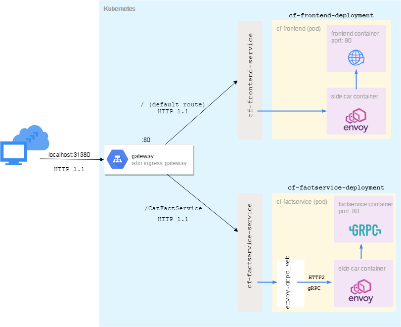

# Cat Facts via gRPC

## Additional Takeaways
Additional tid bits I found interesting that aren't called out directly in the commented source.

### Beware the LoadBalancer Service type
When Istio is installed onto your Kubernetes cluster, a pod is deployed called the ingressgateway. This is the pod responsible for handling incoming traffic into your mesh. This pod is created using LoadBalancer as the service type (at least using the [helm installer](https://istio.io/docs/setup/kubernetes/install/helm/).

LoadBalancer is a service type that exists to work with an already existing, external load balancer. If you do not have one, as is the case with Kubernetes for Docker Destop, the port won't actually be exposed and no traffic will be allowed into your cluster.

To rectify this, you may need to update your istio.yaml and change the istio-ingressgateway Service to be of type NodePort which will simply expose the port and allow traffic.

As an aside, if you're using [Minikube](https://kubernetes.io/docs/setup/minikube/) to run your cluster, this won't be an issue as Minikube does support this type.

The unfortunate part of all of this is that when trying to use a service of type LoadBalancer using bare Kubernetes, with no Istio, the External IP value will be in a *pending* status to let you know it could not create an external IP and traffic will not be allowed into the cluster. This makes it incrediably easy to figure out why traffic isn't getting into your cluster, because you wont even be given an IP address to test with.

When bringing Istio into the mix, however, the External IP value will be 'localhost'. This led me to a long, false assumption that everything was working.

### The Istio namespace (and Kubernetes namespaces in general)
One thing that tripped me up for a bit was the fact that when you're installing Istio (again, at least through Helm), you define a namespace for all of the Istio components to be associated with. Most examples I've seen are **istio-system**. You do this via:

`
kubectl create namespace istio-system
`

Some time later though, you'll want to setup **automatic sidecar injection**. When using Istio, all pods will not only be deployed with your container, but will also have an Envoy proxy running next to it in the same pod. However, it would be a little silly if you had to manually define and manage the sidecar for all of your deployments (though possible). To make for a better expirence, there is a label you can set on a **namespace** that will automatically add an envoy sidecar into pods that are created in that namespace. You do this via:

`
kubectl label namespace default istio-injection=enabled
`

It was a little jarring at first that we created this istio-system namespace for Istio to live in, but then moments later we're setting istio-injection on the default namespace. We do this because when we add a new deployment, it goes into the default namespace by default (I know, it's shocking).

Namespaces are really just a way to organize resources within Kubernetes. You can apply policies for teams/devs and group things however you like. But Kubernetes can still talk to resources in other namespaces with ease. So with that in mind, you wouldn't add it to the istio-system namespace because that namespace should really just be for istio-related resources.
